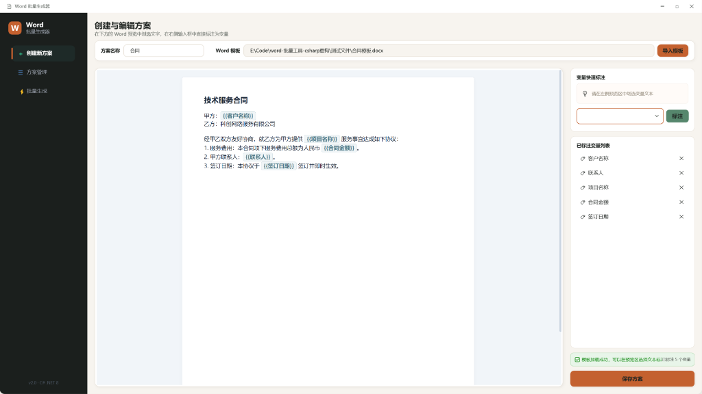
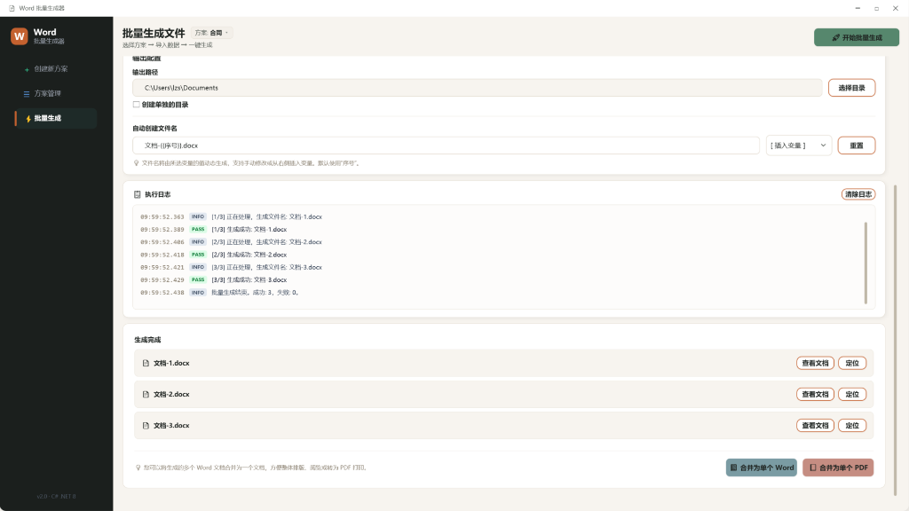
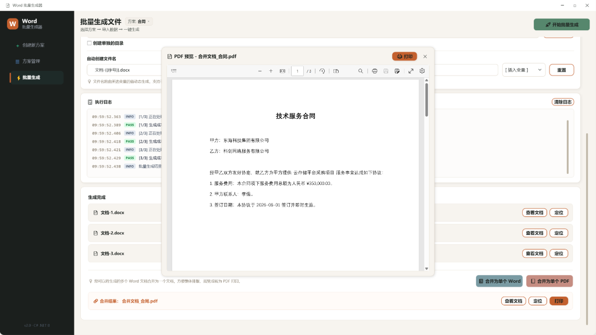

# Word 批量生成器 v2.0

> **基于 .NET 8 + WPF 构建的 Word 批量变量替换与文件生成工具。**  
> 从 Excel 数据源批量生成 Word 文档，支持实时预览、多分辨率高清渲染、一键转换 PDF，单文件绿色部署，无需安装任何 Office 运行时。

---

## 📸 界面预览

### 1. 创建与编辑方案
在可视化的 Word 预览区中，实时查看模板排版并自动识别或手动标注变量占位符。


### 2. 批量生成文件与实时日志
导入 Excel 数据源后可进行数据预览，一键生成过程中有详细的日志与状态指示（PASS/FAIL/INFO/WARN）。


### 3. PDF 合并与打印预览
支持一键将生成的多个 Word 文档合并为单个 Word 或单个 PDF 文件，并提供无缝的 PDF 高清预览与打印。


### 4. 方案管理
轻松管理所有配置方案，支持 `.wsp` 格式的方案包导入与导出，方便团队间协作与迁移。


---

## ✨ 功能特性

### 🗂️ 方案管理
- **方案独立存储**：创建、编辑、删除方案，每个方案独立存储配置与模板。
- **导入 / 导出 `.wsp` 方案包**：可将方案打包分享给他人，或跨机器迁移。
- **状态持久化**：自动记录上次使用的方案及窗口大小，下次启动直接还原。

### 📄 模板配置
- **可视化预览**：导入 Word 模板（`.docx`），在预览区实时查看排版效果。
- **变量快速标注**：支持 `{{变量名}}` 语法，也支持在预览区划选任意文本直接标注为变量。
- **变量自动提取**：自动解析正文、页眉、页脚中的占位符，并与 Excel 表头进行智能匹配。
- **合并 Run 正常化**：内置 `RunNormalizer` 算法，彻底解决 Microsoft Word 编辑导致的占位符 XML 标签被分割拆碎、导致无法识别替换的业界顽疾。

### ⚡ 批量生成
- **Excel 数据驱动**：从 Excel 读取数据（`.xlsx`），每一行数据自动生成一份 Word 文件。
- **自定义文件名**：支持使用变量插值命名（如 `合同-{{客户名称}}.docx`）。
- **智能子目录分类**：支持根据 Excel 中的变量列自动创建子文件夹进行分类输出。
- **全局序号注入**：自动注入 `{{序号}}` 变量（无需 Excel 中预先设置），方便编号。
- **高级文件合并**：生成完成后，支持将所有生成的文档一键合并为一个 Word 或单个 PDF 文件。

### 🖨️ 预览与打印
- **无缝 PDF 预览**：基于 Microsoft WebView2 内核，生成高保真的 PDF 预览。
- **便捷打印**：支持在预览界面直接调用系统打印机打印生成的文档。

---

## 🚀 快速开始（用户）

### 方式一：安装版（推荐，图标最稳定）

1. 下载并运行 `installer\output\Word批量生成器_v2.0_Setup.exe`。
2. 按照安装向导完成安装，程序会自动在桌面和开始菜单创建快捷方式。

### 方式二：绿色单文件版

1. 将 `dist\Word批量生成器.exe` 复制到您的电脑任意目录。
2. 双击运行即可，程序会自动检测并提示安装 WebView2 运行时（通常 Windows 10/11 已内置）。

> 💡 **注意**：如果直接将 exe 放在桌面，Windows 对大文件（>50MB）的桌面图标提取有超时限制，可能显示默认图标。建议使用安装版，或运行 `创建桌面快捷方式.bat` 在桌面创建快捷方式。

---

## 📖 使用指南

### 第一步：新建配置方案
1. 打开软件，点击左侧导航栏的 **「新建方案」**。
2. 输入方案名称（例如：`合同生成`）。
3. 点击右侧的 **「导入模板」**，选择您的 Word 模板文件（`.docx`）。
4. 在左侧的 Word 预览区，直接划选想要作为变量的文字，在右侧点击 **「标注」** 设为变量；或者使用 `{{变量名}}` 语法。
5. 确认右侧 **「已标注变量列表」** 无误后，点击右下角 **「保存方案」**。

### 第二步：导入数据并生成
1. 点击左侧导航栏的 **「批量生成」**。
2. 在顶部下拉框中选择您刚刚保存的方案。
3. 点击 **「导入 Excel 数据」**，选择对应的数据表（表头必须与方案中的变量名完全一致）。
4. 检查下方的 **「数据预览」** 表格，确认数据加载正确。
5. 设置您的输出路径和文件名模板（例如：`文档-{{序号}}-{{客户名称}}.docx`）。
6. 点击右上角 **「开始批量生成」**。
7. 生成结束后，可在执行日志区查看每份文件的生成状态。点击右下角的 **「合并为单个 Word」** 或 **「合并为单个 PDF」** 进行合并与预览打印。

---

## 🛠️ 开发者指南

### 环境要求
- [.NET 8 SDK](https://dotnet.microsoft.com/download/dotnet/8.0)
- Windows 10 / 11 (WPF 仅支持 Windows 平台)
- Visual Studio 2022 / VS Code

### 技术栈与主要依赖

| 组件 | 版本 | 用途 |
|------|------|------|
| .NET 8 + WPF | 8.0 LTS | 应用程序开发框架与 UI 渲染 |
| ModernWpfUI | 0.9.6 | 提供 Windows 11 Fluent 风格的现代化控件 |
| DocumentFormat.OpenXml | 3.0.2 | 无需依赖 Word 组件的 OpenXML 读写引擎 |
| EPPlus | 7.1.3 | 高性能的 Excel 数据集读取与解析 |
| Microsoft WebView2 | 1.0.2535 | 嵌入式 Edge 内核，用于 HTML 预览及 PDF 渲染 |

### 项目目录结构
```
word-批量工具-csharp重构/
│
├── WordBatchGenerator/              # 主 WPF 应用程序项目
│   ├── Core/
│   │   ├── WordParser.cs            # Word -> HTML 转换、变量标注替换、Run 正常化
│   │   ├── ExcelHandler.cs          # Excel 数据源读取与表头解析验证
│   │   ├── Generator.cs             # 核心批量生成逻辑与 PDF 合并导出服务
│   │   └── SchemeManager.cs         # 方案的 CRUD、本地存储与 .wsp 包导入导出
│   ├── Gui/
│   │   ├── Panels/
│   │   │   ├── NewSchemePanel.xaml  # 新建与编辑方案面板 (Word 预览与划选标注)
│   │   │   ├── SchemeListPanel.xaml # 方案管理与导入导出面板
│   │   │   └── GeneratePanel.xaml   # 数据源导入、批量生成与合并预览面板
│   │   ├── ModernMessageBox.xaml    # 现代 Fluent 风格对话框
│   │   ├── PrintWindow.xaml         # 打印预览与 WebView2 容器
│   │   └── Themes/                  # 颜色与全局主题样式
│   ├── Resources/
│   │   ├── app.ico                  # 包含多分辨率的 Windows 高清图标资源
│   │   └── app.png                  # 图标源文件
│   └── WordBatchGenerator.csproj   # 项目构建及单文件打包配置
│
├── installer/
│   └── setup.iss                    # Inno Setup 自动打包脚本
│
├── scripts/
│   ├── make_ico.ps1                 # PNG 转换为多尺寸高清 ICO 脚本
│   └── check_icon.cs               # PE 图标资源提取调试工具
│
├── dist/                            # 本地发布可执行文件输出目录
├── build_installer.bat              # Windows 下一键生成安装包脚本
├── build_single_file.bat            # Windows 下一键发布单文件脚本
└── 创建桌面快捷方式.bat              # 辅助生成桌面快捷方式脚本
```

### 编译发布

#### 1. 运行本地开发调试
```bash
cd WordBatchGenerator
dotnet run
```

#### 2. 一键发布单文件 `.exe`
直接在项目根目录下双击运行 `build_single_file.bat`。  
或者在终端中运行：
```bash
dotnet publish WordBatchGenerator/WordBatchGenerator.csproj -c Release
```
发布后的绿色单文件将输出至 `dist/Word批量生成器.exe`（自包含运行时，文件大小约 74MB）。

#### 3. 一键构建安装包
直接双击运行根目录下的 `build_installer.bat`（电脑需安装 [Inno Setup 6](https://jrsoftware.org/isinfo.php)）。  
打包后的安装包将输出至 `installer/output/Word批量生成器_v2.0_Setup.exe`（大小约 68MB）。

---

## 💾 本地数据存储与持久化

应用采用轻量化的本地文件存储，不写入系统注册表，完全支持便携运行（U盘运行）：
```
%LOCALAPPDATA%\WordBatchGenerator\
├── Schemes\
│   ├── <方案名称>\
│   │   ├── config.json      # 方案配置文件 (保存变量列表、模板相对路径等)
│   │   └── template.docx    # 导入的 Word 模板文件副本
│   └── last_state.json      # 自动记录的窗口尺寸、位置和上一次激活的方案
└── WebView2_Cache\          # WebView2 浏览器渲染内核缓存目录
```

---

## 📄 开源许可证

本项目采用 [MIT License](LICENSE) 开源许可证。
